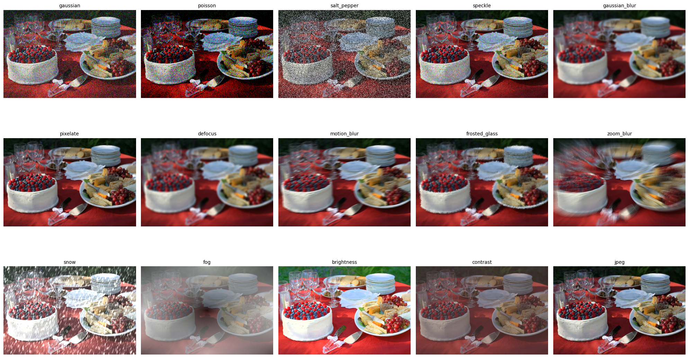

# **NoisySAM - Evaluate foundation model robustness under perturbations for natural image segmentation [Ongoing]**

- This project evaluates the robustness of foundation segmentation models under different types of noise and image perturbations.

- The goal is to systematically test how segmentation performance changes when images are affected by transformations such as geometric distortions, noise injection, color shifts, and mixed-image augmentations.

---

## **MODELS**

- These models are currently evaluated:
  - SAM
  - MobileSAM
  - FastSAM

## **DATASETS**

- COCO 2017 (validation)
- VOC Pascal 2012 (validation)
- ADE20K (validation)

Please download dataset from this link: [DATASET](https://drive.google.com/drive/folders/13F7XKDBIV-9y4c2LejBK3bt5Upr1HcZs?usp=sharing)

### DATA FORMAT

- All dataloaders in this project return data in a unified format to simplify benchmarking across datasets.
  {
  "image_id": str,
  "image": np.ndarray, # (H, W, 3) RGB image
  "canvas_height": int,
  "canvas_width": int,
  "labels": List[str], # object class names
  "bounding_boxes": List[List[int]], # [x_min, y_min, x_max, y_max]
  "masks": List[np.ndarray] # binary masks (H, W)
  }
- Please read **utils/dataLoader.py** for further understanding

## **CORRUPTIONS & PERTURBATIONS**

To evaluate the robustness of SAM variants, this project implements a rigorous noise injection pipeline via the `NoiseInjection` class. Each corruption can be applied with varying levels of **Severity (1-5)**, simulating real-world environmental challenges and digital artifacts.

<p align="center">
  
</p>

### 1. Statistical Noise

These methods simulate sensor limitations and photon counting errors in digital imaging.

- **Gaussian Noise**: Simulates electronic circuit noise by adding random values from a normal distribution.
- **Poisson Noise (Shot Noise)**: Mimicts the statistical nature of light arrival (photons) at the sensor.
- **Salt & Pepper**: Randomly replaces pixels with white or black, simulating bit errors during transmission.
- **Speckle Noise**: Multiplicative noise often seen in medical ultrasound or radar imaging.

---

### 2. Blur Artifacts

Simulates loss of focus, camera movement, or environmental factors that reduce image sharpness.

- **Defocus Blur**: Mimics a camera being out of focus using a disk-shaped kernel.
- **Motion Blur**: Simulates the effect of camera shake or objects moving fast during exposure.
- **Zoom Blur**: Creates a radial blur effect, simulating the lens zooming during a shot.
- **Frosted Glass Blur**: Replicates the scattering of light through a textured translucent surface.

---

### 3. Weather & Environmental Effects

Complex perturbations that simulate challenging outdoor conditions.

- **Fog**: Uses plasma fractals to simulate non-uniform visibility reduction.
- **Snow**: Combines motion-blurred "snowflakes" with a global brightness shift to mimic winter conditions.

---

### 4. Digital & Photographic Distortions

Artifacts introduced during image processing, compression, or lighting changes.

- **Pixelate**: Reduces the spatial resolution of the image, creating a "blocky" effect.
- **JPEG Compression**: Simulates artifacts caused by the lossy JPEG encoding algorithm.
- **Contrast & Brightness**: Evaluates the model's sensitivity to lighting conditions and dynamic range.

---

## Noise Implementation Details

The noise pipeline is highly modular, utilizing the following libraries:

- **Albumentations**: For high-performance statistical noise.
- **OpenCV & SciPy**: For custom kernel-based blurs and transformations.
- **Scikit-Image**: For color space conversions and complex filtering.

You can customize the severity ranges and noise types in `utils/noise_injection.py`.

## MODELS

This project evaluates three major architectures of the Segment Anything family. All models are wrapped in a unified interface inherited from `AbstractLoader` to ensure consistency in the evaluation pipeline.

### Supported Architectures

| Model Family   | Variant         | Checkpoint File        | Backend Library    |
| :------------- | :-------------- | :--------------------- | :----------------- |
| **SAM (v1.0)** | ViT-Base        | `sam_vit_b_01ec64.pth` | `segment_anything` |
| **SAM (v1.0)** | ViT-Huge        | `sam_vit_h_4b8939.pth` | `segment_anything` |
| **MobileSAM**  | Tiny-ViT        | `mobile_sam.pt`        | `mobile_sam`       |
| **FastSAM**    | Small (s)       | `FastSAM-s.pt`         | `ultralytics`      |
| **FastSAM**    | Extra Large (x) | `FastSAM-x.pt`         | `ultralytics`      |

### Model Zoo & Setup

1. **Original SAM (Meta AI)**: High-accuracy foundation models.
   - [Download sam_vit_b](https://dl.fbaipublicfiles.com/segment_anything/sam_vit_b_01ec64.pth)
   - [Download sam_vit_h](https://dl.fbaipublicfiles.com/segment_anything/sam_vit_h_4b8939.pth)

2. **MobileSAM**: Optimized for mobile and CPU efficiency, ~40MB in size.
   - [Download mobile_sam.pt](https://github.com/ChaoningZhang/MobileSAM/blob/master/weights/mobile_sam.pt)

3. **FastSAM**: Based on YOLOv8 instance segmentation, optimized for real-time inference.
   - [Download FastSAM-s/x](https://github.com/CASIA-IVA-Lab/FastSAM)

---

### Model Loading Logic

The `utils/modelLoader.py` provides a standardized way to interact with different model backends. Each class implements `_set_image()` and `_predict()` methods to abstract away the specific API calls of each library.

### Example: Initializing a Model

You can initialize any model variant and move it to the appropriate device (CUDA is automatically detected) as follows:

```python
from utils.modelLoader import SAM1, MobileSAM, FastSAMModel

# Initialize SAM ViT-B
sam_b = SAM1(
    model_name="SAM_b",
    model_type="vit_b",
    checkpoint="path/to/sam_vit_b.pth"
)

# Initialize FastSAM
fast_sam = FastSAMModel(
    model_name="FastSAM_x",
    model="path/to/FastSAM-x.pt"
)
```

## USAGE

- TO RUN FULL PIPELINE PLEASE READ **main.py**
